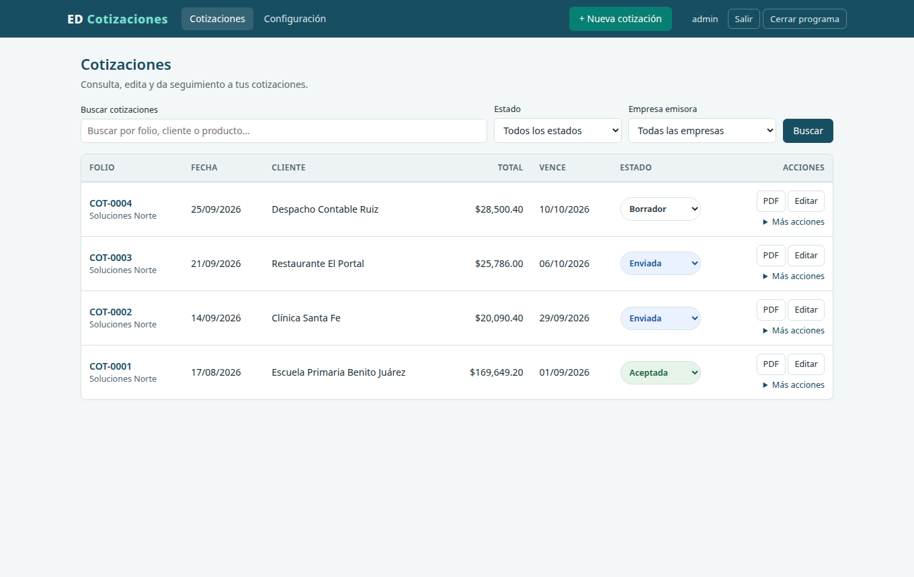
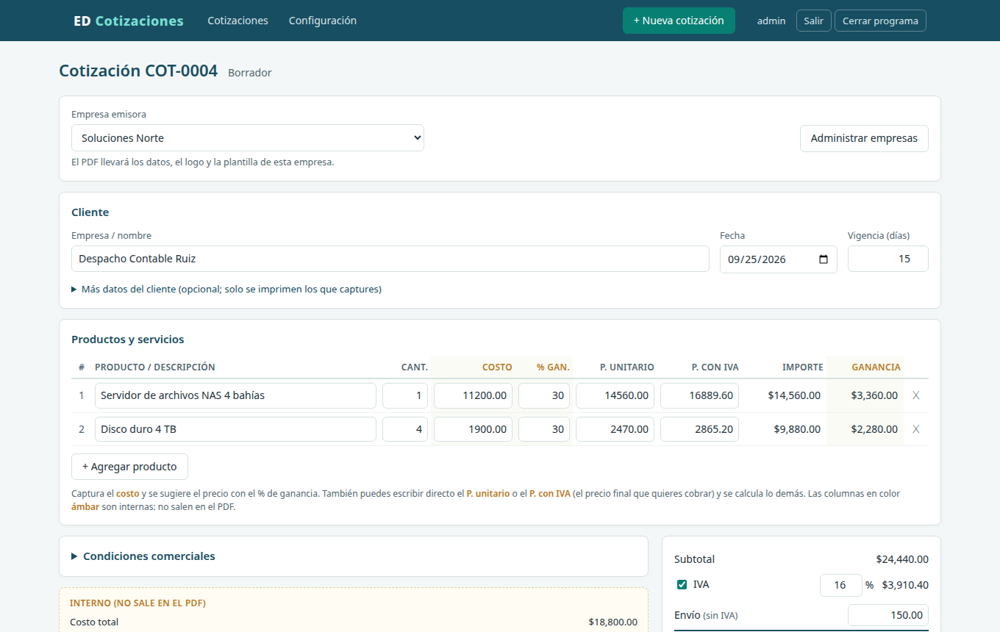
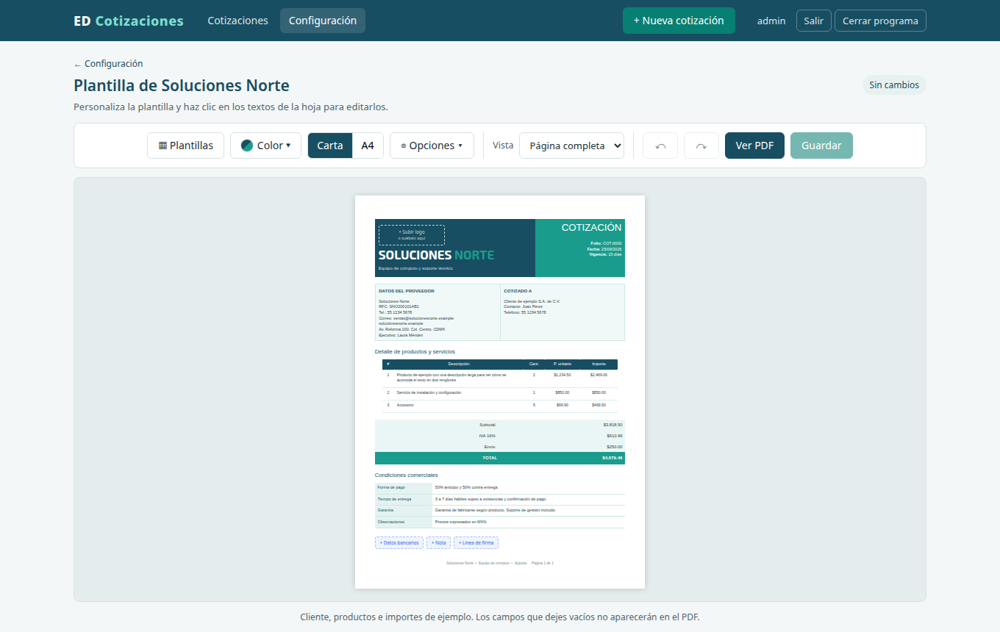
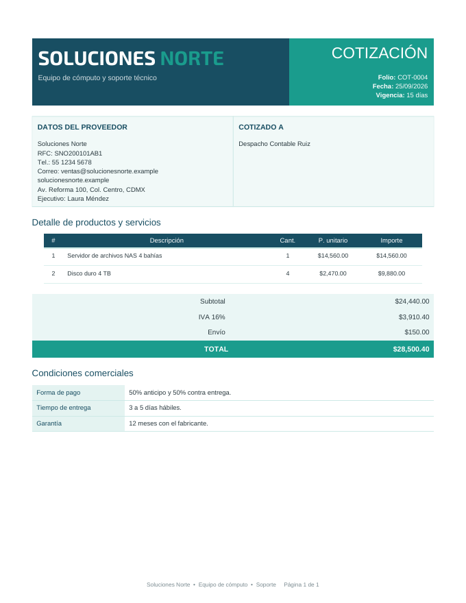

# EDCotizacion

[](https://github.com/Naraku86/EDCotizacion/actions/workflows/ci.yml)
[](https://github.com/Naraku86/EDCotizacion/releases/latest)
[](LICENSE)

[English](README.md) · **Español**

Cotizaciones para pequeños negocios: capturas la cotización y obtienes un PDF limpio. Corre en tu
propia computadora (Windows, macOS o Linux), guarda todo en un archivo SQLite local y funciona sin
internet. También puede correr en un servidor con Podman o Docker.



## Qué hace

- **Cotizaciones en PDF** con cuatro diseños (clásica, minimalista, moderna, compacta), tus colores,
  logo y papel Carta o A4. Todo lo que sale en el PDF se edita directamente sobre la hoja.
- **Varias empresas** en una misma instalación, cada una con sus datos, logo y plantilla.
- **Clientes y productos se dan de alta solos**: escribes el nombre y, si no existe, se agrega al guardar.
- **Precios**: costo + % de ganancia (30% por defecto), o escribes directo el precio final con o sin IVA.
  El envío va aparte y no lleva IVA.
- **Historial** con búsqueda, estados (Borrador / Enviada / Aceptada / Rechazada), cotizaciones
  vencidas en rojo, editar, duplicar y volver a generar el PDF.
- **Demo público** en `/demo`: cualquiera captura una cotización en una sola página y descarga el
  PDF, sin cuenta y sin que se guarde nada en el servidor.
- **Seguridad**: contraseñas con BCrypt, cambio obligatorio de la contraseña de fábrica, freno a
  intentos por usuario e IP, CSRF y CSP estricta. Por defecto solo acepta conexiones de la misma computadora.

| Formulario | Editor de plantilla | PDF |
|---|---|---|
|  |  |  |

## Descargar

Descarga la última versión en **[Releases](https://github.com/Naraku86/EDCotizacion/releases/latest)**.
Java viene incluido; no hay que instalar nada más.

| Sistema | Archivo |
|---|---|
| Windows 10/11 | `EDCotizacion-<versión>-windows-x64.msi` |
| macOS Apple Silicon (M1–M4) | `EDCotizacion-<versión>-macos-arm64.dmg` |
| macOS Intel | `EDCotizacion-<versión>-macos-x64.dmg` |
| Debian, Ubuntu, Linux Mint | `EDCotizacion-<versión>-linux-x64.deb` (o `arm64`) |
| Fedora, RHEL, openSUSE | `EDCotizacion-<versión>-linux-x64.rpm` (o `arm64`) |
| Cualquier Linux, sin instalar | `EDCotizacion-<versión>-linux-x64-portable.tar.gz` |
| Windows, sin instalar | `EDCotizacion-<versión>-windows-x64-portable.zip` |

Los binarios **todavía no están firmados**, por eso Windows y macOS muestran una advertencia la
primera vez. La [guía de instalación](docs/es/instalacion.md) explica cómo abrirlos en cada sistema.

## Primeros pasos

1. Instala y abre **EDCotizacion**. Se abre el navegador en <http://localhost:8090>.
2. Entra con usuario **admin** y contraseña **admin**. La app pide elegir una contraseña nueva.
3. En **Configuración › Empresas y plantillas** captura los datos de tu empresa, logo y plantilla.
4. Pulsa **+ Nueva cotización**.

Un icono junto al reloj (bandeja del sistema) permite volver a abrir el navegador o salir. Donde no
hay bandeja (algunos escritorios Linux), usa **Cerrar programa** en la barra superior.

Tus datos viven en la carpeta `EDCotizacion` dentro de tu carpeta de usuario. Para respaldar, copia
`cotizaciones.db`. Detalles en la [guía de instalación](docs/es/instalacion.md#tus-datos).

## Servidor (Podman / Docker)

```bash
podman run -d --name edcotizacion -p 8090:8090 -v edcotizacion-datos:/data \
  ghcr.io/naraku86/edcotizacion:latest
```

Funciona igual con `docker`. La [guía de servidor](docs/es/servidor.md) explica Compose, HTTPS con
proxy inverso, respaldos y actualizaciones.

## Documentación

| | |
|---|---|
| [Instalación](docs/es/instalacion.md) | Windows, macOS y Linux; advertencias por binarios sin firmar; actualizar; desinstalar |
| [Servidor](docs/es/servidor.md) | Podman/Docker, Compose, proxy inverso, respaldos |
| [Configuración](docs/es/configuracion.md) | Puerto, acceso en red, demo público, carpeta de datos |
| [Uso](docs/es/uso.md) | Plantilla del PDF, varias empresas, demo, varias instalaciones |
| [Desarrollo](docs/es/desarrollo.md) | Compilar desde el código, pruebas, empaquetado, publicar versiones |
| [Seguridad](SECURITY.md) | Reportar vulnerabilidades y protecciones incluidas |
| [Cambios](CHANGELOG.md) | |

## Hecho con

Java 21 · Spring Boot 4 · Spring Security · Spring Data JPA (Hibernate) · Thymeleaf · SQLite + Flyway ·
OpenHTMLtoPDF · jpackage

## Licencia

[MIT](LICENSE) © 2026 Edgar Vigueras
