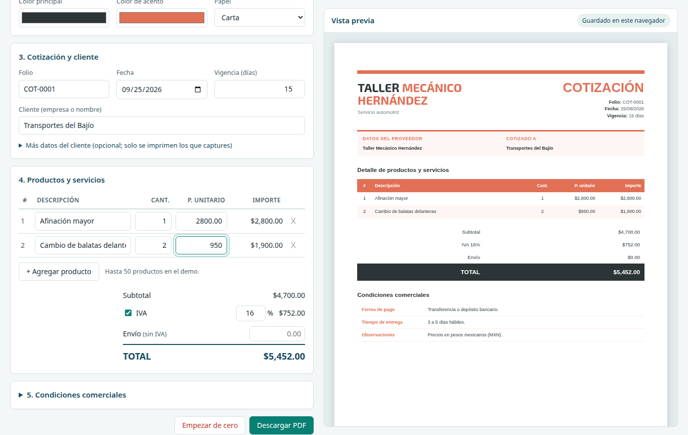

# Usage

**English** · [Español](../es/uso.md)

The interface is in Spanish; the names of buttons and menus are shown in *italics* with their
meaning in parentheses.

## Quotes

- *+ Nueva cotización* (new quote) opens the form. Type the client: if it exists it is filled in;
  if not, it is created when you save. Products work the same way.
- For each product you can enter the **cost** and a price is suggested with the margin (30% by
  default), or type the **unit price** or the **price including VAT** directly and the rest is
  calculated. The amber columns (cost, profit) are internal: they are not printed on the PDF.
- VAT is optional per quote. **Shipping** (*envío*) is added separately and carries no VAT.
- The number is assigned on save (`COT-0001`, `COT-0002`…; prefix and next number in *Configuración*).
- In the history: search by number, client or product; statuses *Borrador* / *Enviada* / *Aceptada* /
  *Rechazada* (draft / sent / accepted / rejected); expired quotes are shown in red; edit, duplicate
  and regenerate the PDF.

## PDF template

*Configuración › Empresas y plantillas › Editar datos y plantilla* (settings › companies and templates ›
edit data and template) shows the page exactly as the PDF will look, and you edit it in place:

- Click any text (name, tax ID, titles, table headers, footer…) to change it. Anything left empty is
  not printed.
- Upload or drop the logo on the dotted box in the header (PNG or JPG).
- *Plantillas* (templates): gallery with examples (classic, minimal, modern, compact and color
  variants), shown with your data.
- *Color*, *Carta / A4* (Letter / A4) and *Opciones* (upper-case name, # column, page numbers…).
- Optional sections: bank details, note, signature line.
- *Ver PDF* (view PDF) without saving, undo/redo (Ctrl+Z / Ctrl+Y) and Ctrl+S to save.

## Several companies

1. In *Configuración › Empresas y plantillas*, type the name and click *Agregar empresa* (add company).
2. Edit its data, logo and layout, and save the template.
3. When creating or editing a quote, choose *Empresa emisora* (issuing company). The PDF uses its
   data and template.
4. The history shows the company under the quote number and can be filtered by company.

Clients, products, quote numbering and preferences are shared by all companies. Every user of the
installation can work with every company.

## Public demo (`/demo`)

`http://localhost:8090/demo` opens without signing in (there is also a link on the sign-in page). On
a single page you enter company data and logo, pick a layout, colors and paper, enter client,
products and terms, and download the PDF. The preview updates as you type.

- **Nothing is stored on the server**: the demo does not use the database. What you type stays only
  in the visitor's browser; *Empezar de cero* (start over) clears it.
- Abuse limits: up to 50 products, 10 PDFs and 90 previews per minute per IP, and 2 PDFs being
  generated at the same time.
- Turn it off with `app.demo.activo: false` (see [Configuration](configuration.md)).

## User and password

Your user name, top right, opens *Cuenta* (account), where user name and password are changed.
After 5 failed attempts from the same computer you have to wait 5 minutes.
